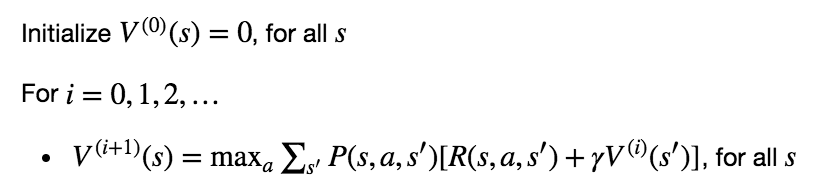
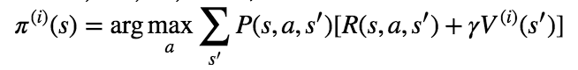
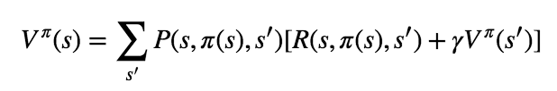

# [Lab 1 of Reinforcement Learning Bootcamp](https://drive.google.com/file/d/0B1BwaUH2mk-EdXI5dzlLbWl5R0E/view)

All lecture videos can be found [here](https://sites.google.com/view/deep-rl-bootcamp/lectures)

## Summary:

This lab consists of three problems:

1. [Problem 1: Value Iteration](src/problem_1.ipynb) 
	* The main idea is that if we can learn the "value" of each state, we can choose the action that has the highest expected value.
	* Iteratively learning what the value is for each state:
	
	* What the heck is the equation saying above?
		* `V` is the value assigned to each state `s`
		* `s'` can be thought of as the "next state"
		* `R` is the reward for taking action `a` in state `s` and ending up in state `s'`.
		* Gamma is the penalization we assign to future rewards/values
		* `V(s')` is the "value" at the next state `s'`
		* The value, `V`, that gets assigned to the state `s` is the maximum expected reward given all possible actions. (this is what the "max a" thing is trying to say)
		* What is `P`?
			*`P` is the probability of ending up in state `s'` if we start in state `s` and take action `a`
			* Taking an action in a certain state may not always result in the same "next state". These state transitions may be stochastic. 
	* Once we know the values of each state, we can make an optimal policy:
	
2. [Problem 2: Policy Iteration](src/problem_2.ipynb)
	* Very similar concept to value iteration
	1. We start with a policy that takes a random action within each state
	2. With the current policy, we can calculate the value of each state (don't even have to iterate since we have a linear set of equations) 

	

	3. Calculate the quality (Q) for each state/action pair. This is done using the current policy.
	4. Update the current policy to take the action that results in the highest quality.
	5. Return to step "ii" until convergence
3. [Problem 3: Sampling Based Q-learning](src/problem_3.ipynb)
	* Another similar concept as the previous two problems
	* Useful in situations where we don't know a lot about the environment. For example, we don't know `P`.
	* To learn an optimal policy, we first try to improve our "idea" of quality `Q(s,a)`.
	* To learn what `Q(s,a)` should be for each state/action pair, we simply take actions and update values:
	

	Turn this:

	

	Into this:

	